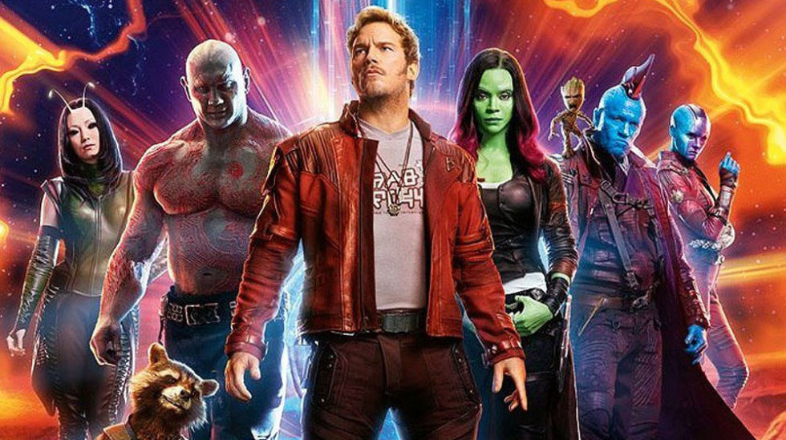
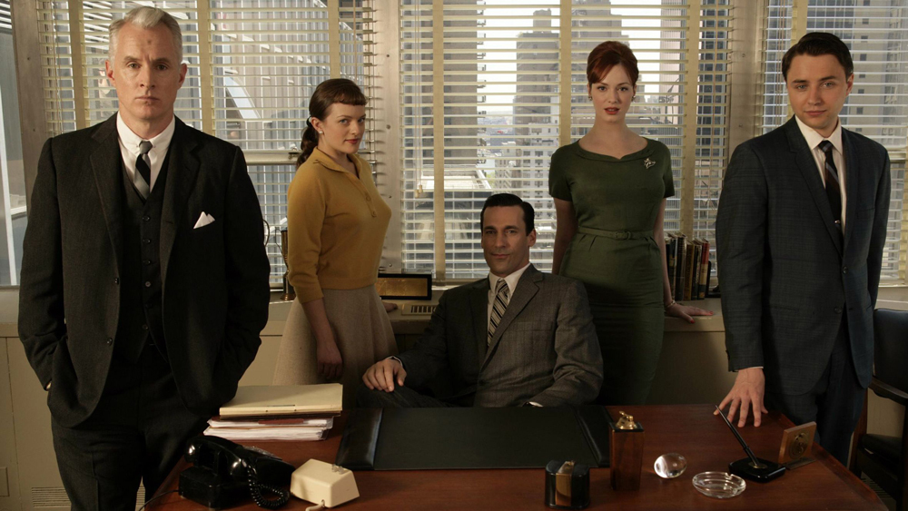
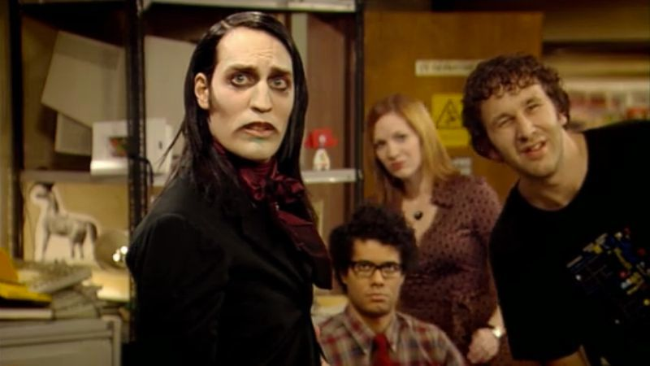
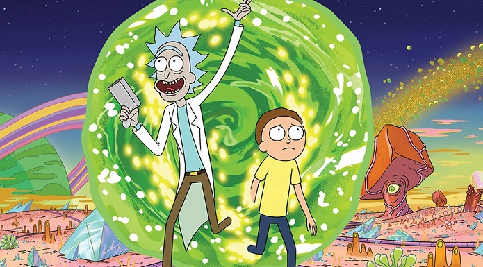

# PARSEC Labs

## Team

#### [@johannbarbie](https://github.com/johannbarbie)
- Facilitator and Contract Maestro in [dappdev circle](dappdev.md)
- Facilitator and Public Speaker in [general circle](general-circle.md)
- Lead Link and Researcher 1 in [r'n'd circle](rnd.md)

#### [@mateleshkavo](https://github.com/mateleshkavo)
- Roadmap Maintainer in [general circle](general-circle.md)
- Lead Link in [communications circle](comm.md)

#### [@t1mberwolf](https://github.com/t1mberwolf)
- Secretary and Community Link in [communications ](comm.md)circle

#### [@a5kold](https://github.com/a5kold)
- Facilitator in [communications circle](comm.md)

#### [@sunify](https://github.com/sunify)
- Lead Link, Chief Memes Officer and Node Craftsman in [dappdev circle](dappdev.md)
- Web Dev in [communications circle](comm.md)
- Secretary and Facilitator in [r'n'd circle](rnd.md)

#### [@troggy](https://github.com/troggy)
- Secretary and Treasurer in [general circle](general-circle.md)
- Testnet Commander in [dappdev circle](dappdev.md)
- Researcher 2 in [r'n'd circle](rnd.md)

#### [@oz1127](https://github.com/oz1127)
- Secretary in [dappdev circle](dappdev.md)

## Circles

### [General Circle](general-circle.md)

Manages organization-wide questions

### [Communications Circle](comm.md)

Responsible for communicatons with the world

#### Vacant roles

- Event Organizer

### [DappDevelopment Circle](dappdev.md)

Responsible for application development

#### Vacant roles

- Roadmap Keeper
- Infrastructure Lieutenant

### [Research and Development Circle](rnd.md)

Responsible for research/science stuff
